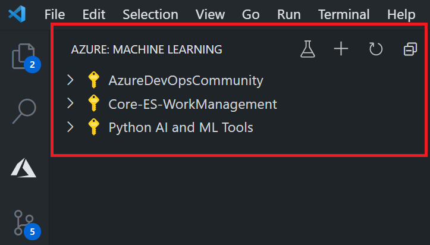
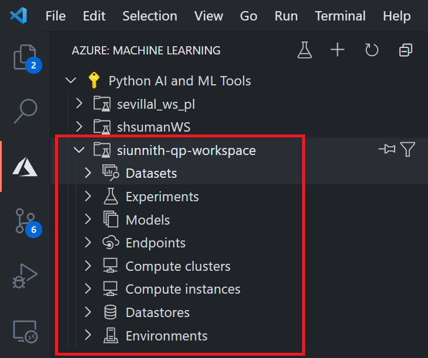
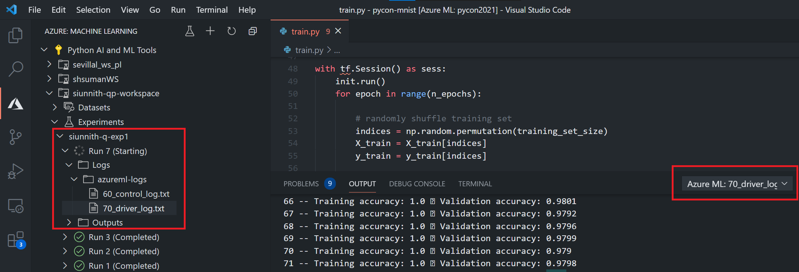
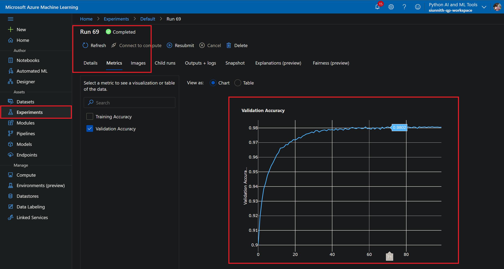

# Training Digit Recognition Model with Azure Machine Learning

In this lab, you will learn how to train and track a machine learning model on a cloud compute cluster through Azure Machine Learning.

You will learn to:
- Deploy machine learning resources in Azure.
- Submit a training job to Azure Machine Learning.
- Use the Azure Machine Learning extension to monitor the state of your run.
- Add logging metrics to your training job.
- Resubmit and track your metrics in the Azure Machine Learning studio.

## Prerequisites

- Azure Subscription (e.g. [Free](https://aka.ms/azure-free-account) or [Student](https://aka.ms/azure-student-account))
- [Visual Studio Code](https://code.visualstudio.com/download)
- The [Azure Machine Learning Extension](https://aka.ms/aml-ext) for Visual Studio Code
- The [Azure Machine Learning SDK for Python](https://docs.microsoft.com/en-us/python/api/overview/azure/ml/install?view=azure-ml-py)

## Create an Azure Machine Learning Workspace

The [Azure Machine Learning workspace](https://docs.microsoft.com/en-us/azure/machine-learning/overview-what-is-machine-learning-studio) is the top-level resource providing you with a centralized place to work with all the artifacts you create.

You can create an Azure ML workspace by clicking here:

[](https://portal.azure.com/#create/Microsoft.Template/uri/https%3A%2F%2Fraw.githubusercontent.com%2FAzure-Samples%2Fazure-python-labs%2Fsiunnith%2F9-azure-machine-learning%2F.cloud%2Fdeploy.json)

For more details about the deployment in the button used above, check the [ARM JSON definition](https://github.com/Azure-Samples/azure-python-labs/blob/siunnith/9-azure-machine-learning/.cloud/deploy.json).

## Submit a Training Job to Azure Machine Learning
Now that you have a workspace set up, you're ready to submit a training job to the Azure Machine Learning service. Through this lab, you're going to train a deep neural network to classify handwritten digits using the [MNIST dataset](https://www.tensorflow.org/datasets/catalog/mnist).

Let's start by examining core files in this repo:
1. `train.py`: The script used to train the neural network for classifying hand-written digits.
1. `utils.py`: Utility script with methods for data preparation and loading.
1. `run_experiment.py`: The script used to create Azure Machine Learning resources and submit the training job to the cloud.
1. `config.json`: The configuration file used by the orchestration script to initialize the workspace.

To familiarize yourself with the training details, please take a quick read through the main train and utility scripts. Once you've completed that, let's take a look at the first file you'll need to modify - the configuration JSON.

```json
{
    "subscription_id": "<input-subscription-id-here>",
    "resource_group": "<input-resource-group-here>",
    "workspace_name": "pyconworkspace"
}
```

The configuration JSON contains Azure-related details. Workspace information has automatically been populated for you under the assumption that you've used the above deployment util. Start by populating the correct values for subscription ID, resource group, and workspace in the configuration file. You can retrieve this information by navigating to the Azure portal and finding your newly created Machine Learning resource.

Once you've modified the configuration JSON, you're ready to take a look at the orchestration script - _run\_experiment.py_. The orchestration script can be broken down into the following sections:
1. Initialize your workspace.
1. Create or use an existing remote compute target.
1. Reference an experiment and environment to use when training.
1. Define a script run configuration.
1. Submit the experiment.

As stated earlier, workspace initialize takes place using the configuration JSON you modified. The _from\_config()_ method of the Workspace class knows to look through your current working directory for a configuration artifact:

```python
workspace = Workspace.from_config()
```

With your initialized workspace, you can now begin to create and manage resources you intend to use during training. The first resource we'll deal with is the [compute target](https://docs.microsoft.com/en-us/azure/machine-learning/concept-compute-target). The compute target is a designated resource used to run your training script. For this lab, we will be creating a managed compute cluster with a single node and a general purpose VM size (Standard_D2_V2). 

```python
from azureml.core.compute import AmlCompute, ComputeTarget

compute_config = AmlCompute.provisioning_configuration(vm_size="STANDARD_D2_V2", max_nodes=1, min_nodes=0)

target = ComputeTarget.create(ws, cluster_name, compute_config)
```

The orchestration script will check to see whether you have an existing compute target named _goazurego_ in your current workspace. If you have a cluster created from before, feel free to change the _cluster\_name_ variable.

All Azure ML training jobs on remote compute are ran in a Docker container materialized through an _Environment_ definition. Your Azure ML environment consists of pip and conda dependencies that should be defined based on the contents of your training script. A base Docker image is used by default, but you can further customize your environment by providing a different image or a Dockerfile to use. In this lab, we will be using a curated environment definition (i.e., one already created by Azure ML) which contains the right tensorflow package and version to run the training script:

```python
environment_name = "AzureML-TensorFlow-1.15-Inference-CPU"
tf_env = Environment.get(workspace=ws, name=environment_name)
```

The next step is to create a script run configuration which is an artifact used to tie together your training scripts and resources you intend to use for the run:

```python
src = ScriptRunConfig(source_directory=".", script="train.py",
        compute_target=target, environment=tf_env)

src.run_config.target = target
```

The last step before submission is to define an experiment. The experiment artifact is used to track progress, metrics, and logs of your training run. Once your experiment and script run configuration have been defined, you can submit the experiment to the Azure Machine Learning service:

```python
experiment_name = "pycon-experiment"
experiment = Experiment(workspace=ws, name=experiment_name)

run = experiment.submit(config=src)
run.wait_for_completion(show_output=True)
```

Execute the following command to run your training script:

```bash
python run_experiment.py
```

Congratulations! You've submitted your first remote training job to the Azure Machine Learning service. Let's move on to see how you can use the Azure Machine Learning extension to monitor the state of your run.

## Using the Azure ML Extension to Monitor Your Run
From within VS Code, you can navigate to the Azure tab from the left-hand side. Assuming you've signed into your Azure account, you can view a list of your Azure subscriptions through the _Machine Learning_ pane.



Expand the node of the subscription you've been using for this lab and find your newly created machine learning workspace. Expanding this node will show you a list of machine learning resources that are associated with your workspace.



You can find the training job you submitted by expanding the _Experiments_ node. The Azure ML extension provides you with real-time updates of the status of your run from directly within VS Code. If you'd like to inspect further details of the run, you can expand the Run and Logs nodes. Double-clicking on a log file will stream it in the output console:



## (Optional) Log Metrics and Track Through the Azure ML Studio
Once your run completes successfully, you're ready to move on to adding a bit of custom logging directly in your training scripts. Previously, the script was simply printing the training and validation accuracy to the console. With Azure ML, you can log metrics as part of your run and then use the [Studio](https://ml.azure.com) to compare metrics across your experiment runs.

Start by adding imports and initializing the run context in the training script:

```python
# todo: import Azure Machine Learning Run class
from azureml.core import Run

# todo: initialize run context
try:
    run = Run.get_context()
except:
    run = None
```

Next, make the following change where the training cycles are occurring:

```python
# todo: Log validation and training accuracies through Azure Machine Learning  
if run is not None:
    run.log('Validation Accuracy', np.float(acc_val))
    run.log('Training Accuracy', np.float(acc_train))
```

One small change needs to be made to the environment used in _run\_experiment.py_. The original environment used does not include the _azureml-core_ package, so we have to add it before continuing: 


```python
# use the curated tensorflow 1.15 environment
environment_name = "AzureML-TensorFlow-1.15-Inference-CPU"
tf_env = Environment.get(workspace=ws, name=environment_name)

# create a clone of the curated environment
tf_env_cloned = tf_env.clone("custom-tensorflow")

# add the azureml core pip package
conda_dependencies = tf_env_cloned.CondaDependencies()
conda_dependencies.add_pip_package("azureml-core")

# add dependencies to python section of the environment
tf_env_cloned.python.conda_dependencies = conda_dependencies
```

Submit your experiment again using the following command:

```bash
python run_experiment.py
```

Finally, navigate to the [Azure Machine Learning Studio](https://ml.azure.com) by either clicking the hyperlink or finding the run in the extension tree view, right-clicking on the node, and choosing the _"View Run in Studio"_ option.

From here you can view individual metrics you've logged and use the UI to compare metrics across different experiment runs.



## Next steps

If you are interested in learning more about different things you can do with Azure Machine Learning, such as deploying and serving your model on inferencing targets you can find [more documentation here](https://docs.microsoft.com/en-us/azure/machine-learning/).

For more samples and notebooks visit the [Azure Machine Learning examples repository](https://github.com/Azure/azureml-examples) and the [Azure Machine Learning example notebooks repository](https://github.com/Azure/MachineLearningNotebooks/).
